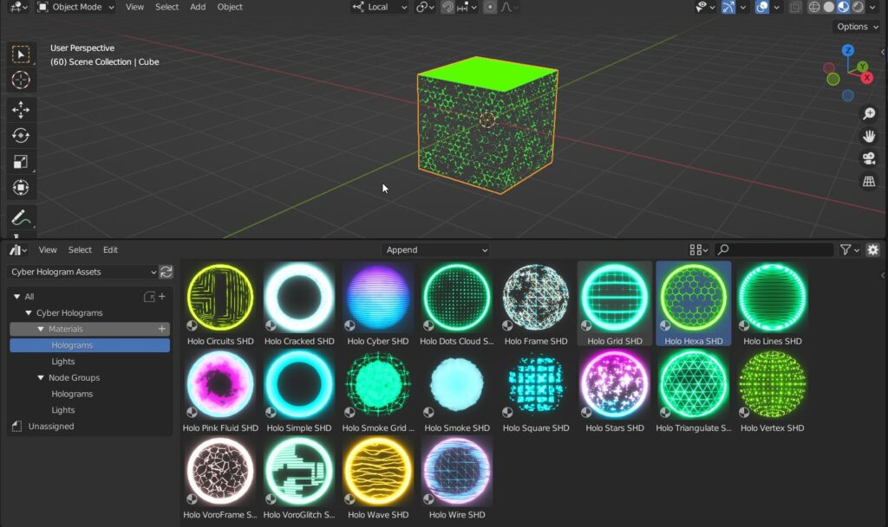
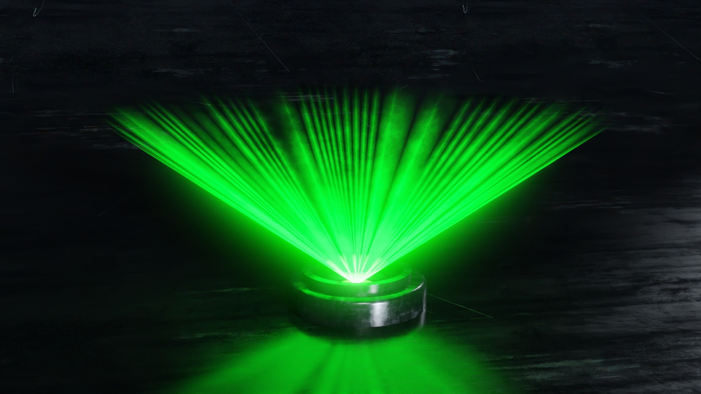
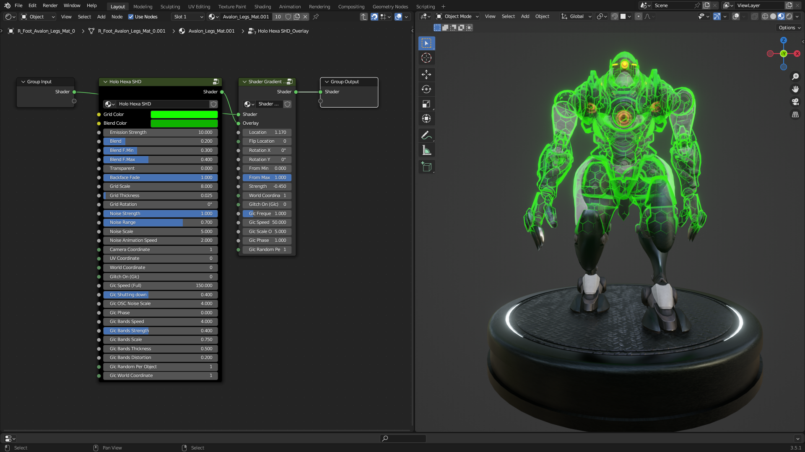
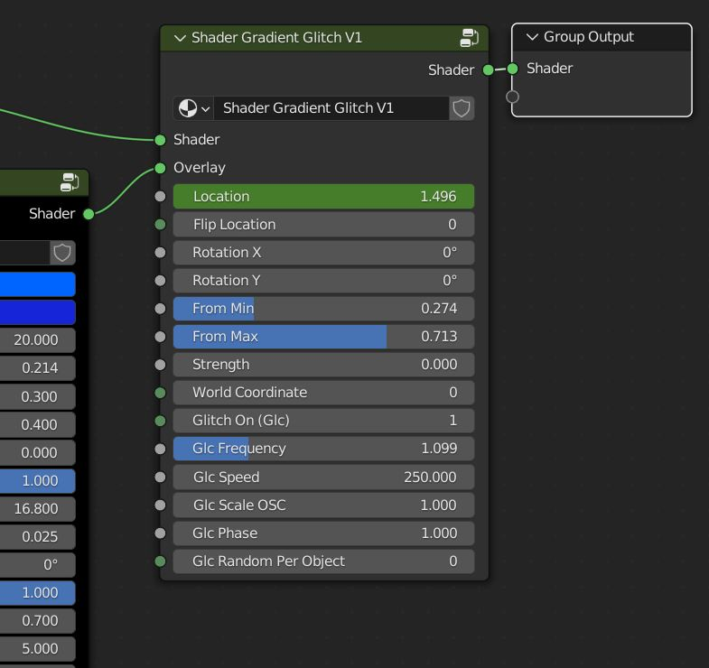

.. _use_in_asset_browser:

Asset Browser Library
========================

This section is dedicated to the use of the Asset Browser version of Cyber Holograms, if you want to use the version
for Extreme PBR, go to the dedicated section here: :ref:`use_in_extreme_pbr`

Open an Asset Browser
-----------------------

.. image:: _static/_images/installation/asset_browser_area_01.jpg
    :align: center
    :width: 800
    :alt: asset_browser_area_01

------------------------------------------------------------------------------------------------------------------------

**Select Cyber Assets from the list**

.. image:: _static/_images/installation/select_cyber_hologram_asset.jpg
    :align: center
    :width: 800
    :alt: select_cyber_hologram_assets

------------------------------------------------------------------------------------------------------------------------

**The library is divided into four sections: Materials Holograms, material Lights, Node groups Holograms and Node Groups Lights**

.. image:: _static/_images/installation/cyber_hologram_categories_example_01.jpg
    :align: center
    :width: 800
    :alt: cyber_hologram_categories_example_01

------------------------------------------------------------------------------------------------------------------------

Apply Hologram material
----------------------------

Select the Materials Holograms section and simply drag and drop an Hologram material onto your model.
The material active on the model will be automatically replaced with the Hologram material

------------------------------------------------------------------------------------------------------------------------

Edit Hologram material
****************************

Once the material has been applied you can edit its parameters like any other material,
to do this, select the material and go to the "Material Properties" tab and you will find all the controls for
customize the effect

.. image:: _static/_images/asset_browser/edit_material_asb_01.jpg
    :align: center
    :width: 800
    :alt: edit_material_asb_01

------------------------------------------------------------------------------------------------------------------------

Color & Emission
---------------------

Every material has its own parameters. In this example you can define the colors of both hexagonal grid and contour,
and set the **Emission strength**

.. Note::

    In the Eevee render engine the material does not illuminate the scene, this is a limitation of Eevee.
    The material will actually illuminate the scene only in the Cycles render engine

.. image:: _static/_images/asset_browser/emission_and_color_asb_01.jpg
    :align: center
    :width: 800
    :alt: emission_and_color_asb_01

------------------------------------------------------------------------------------------------------------------------

Blend Effect
---------------------

Three sliders control the blend between the two colors. Set **Blend F min** and **Blend F max** values close each other
in order to get a sharp transition.

------------------------------------------------------------------------------------------------------------------------

Transparency
---------------------

You can control the transparency of the hologram material, the transparency of the backface, the scale, thickness and rotation of the grid

.. image:: _static/_images/asset_browser/transparent_asb_01.jpg
    :align: center
    :width: 800
    :alt: transparent_asb_01

------------------------------------------------------------------------------------------------------------------------

Noise
---------------------

.. Note::

    The noise texture is animated, press play in the timeline in order to see the effect

You can define the strength of the noise animation, its range of action (proportion between affected and unaffected areas),
its scale and its animation speed

.. image:: _static/_images/asset_browser/noise_asb_01.jpg
    :align: center
    :width: 800
    :alt: noise_asb_01

------------------------------------------------------------------------------------------------------------------------

Change Coordinates
---------------------

The material can be anchored to Camera, UV or World Coordinates, instead of default Generated Local Coordinates.

------------------------------------------------------------------------------------------------------------------------

.. _glitch_effect:

Glitch Effect
---------------------

On top of the noise animation, you can activate another animation named **Glitch**, which consist of a serie of horizontal
bands interfering with the effect

- **Glitch On** activates the animation
- **Glc Speed (Full)** is the base for the speed of the full glitch fx
- **Glc Shutting Down** adds a random complete shutdown of the material

- **Glc OSC noise scale** is a multiplier for the base speed
- **Glc Phase** shifts in time the noise speed
- **Glc Bands Speed** controls the speed of bands only

- **Glc Bands Strength** sets the amount of the speed effect
- **Glc Bands Scale** controls the scale of the bands
- **Glc Bands Thickness** is the proportion between bands and unaffected areas
- **Glc Bands Distortion** makes the bands less readable
- **Glc Random** per object lets you have different appearance on different objects, lastly you can hook the bands to **World Coordinates**

------------------------------------------------------------------------------------------------------------------------

Lights
---------------------

Cyber Holograms Lights work in a very similar way, simply choose an appropriate base mesh, like cones, hemispheres and the like

------------------------------------------------------------------------------------------------------------------------

Hologram Nodes
===================================

.. _hologram_nodes_yt_tutorial:

Youtube Tutorial
---------------------

How to use The Node Groups from Asset Browser
The group nodes are used if you do not have Extreme PBR, this allows you to mix through the nodes available in the Cyber
Holograms asset browser, your material to a Hologram, creating a gradient effect

.. raw:: html

        <iframe width="560" height="315" src="https://www.youtube.com/embed/aadIdW2nBbw" title="YouTube video player"
        frameborder="0" allow="accelerometer; autoplay; clipboard-write; encrypted-media; gyroscope; picture-in-picture;
        web-share" allowfullscreen style="display: block; margin: auto;"></iframe>

------------------------------------------------------------------------------------------------------------------------

Add Node Group
---------------------

In this example the robot has 2 materials

Open an Asset Browser window, select the Cyber Hologram Assets library

In the example below you can see the node tree of the robot material. So you can in the next step, add a node group to create
an Hologram effect

------------------------------------------------------------------------------------------------------------------------

Add Group to Material
-----------------------

Expand the Node Groups category, choose Holograms, drag the Holo Hexa SHD node into the shader editor window

Assicurati di aver selezionato il modello e di essere sul materiale desiderato del modello.

------------------------------------------------------------------------------------------------------------------------

Connect Group to Material
--------------------------

Make sure to drag the hologram group node always between the **Material Output** node and the previous node,
(In this case the **Principled BSDF** node)

Once dragged on the link between the two nodes, the group node will automatically connect

In this example, the robot material is different for each part of the body, so you need to add the group to all the robot
materials if you want all the materials to have the hologram effect. Once done, you can modify the hologram effect through
the group parameters, it will affect all the robot materials.

------------------------------------------------------------------------------------------------------------------------

Edit Group Parameters
--------------------------

In order to edit the parameters, select the Holo Hexa node and press **TAB** key to show the nodes contained within it

|

Set the parameters as you like, as demonstrated in the related tutorials: :ref:`hologram_nodes_yt_tutorial` The changes will affect both materials

------------------------------------------------------------------------------------------------------------------------

Glitch Group
---------------------

The second node, **Shader Gradient Glitch**, controls the parameters by which the effect is blended with the previous material
It is possible to set the position of the separation line, rotate it, establish the type and quantity of blending.

.. Note::

        It is important to understand that the group node must be edited from the inside as shown, this is the only way
        to ensure that the changes are applied to all materials that use the group.

------------------------------------------------------------------------------------------------------------------------

Mix Gradient
----------------

Keeping the From Min and From Max parameters close to each other the separation will be sharp

The Strength value is added globally to the gradient, allowing for further animatable effects

It is possible to anchor the gradient to world coordinates instead of local ones

------------------------------------------------------------------------------------------------------------------------

Glitch Group
---------------------

Here too it is possible to introduce an additional glitch effect, with the usual parameters.

------------------------------------------------------------------------------------------------------------------------

Make individual Node Group
----------------------------

If you want to add the same effect but different settings, use “Append” instead of “Append Reuse Data” before dragging

|

Or once the group has been applied, you can make it independent of the original group, by clicking on "Make Single User"
as in the example below:

Animate Parameters
---------------------

Every parameter can be animated!

|

In order to animate the parameters, you need to right click on the parameter and select **Insert Keyframe**, to do this
keep in mind that the timeline must be open in order to insert the keyframes in the right frame.

.. image:: _static/_images/asset_browser/timeline_keyframe_01.png
    :align: center
    :width: 800
    :alt: timeline_keyframe_01

