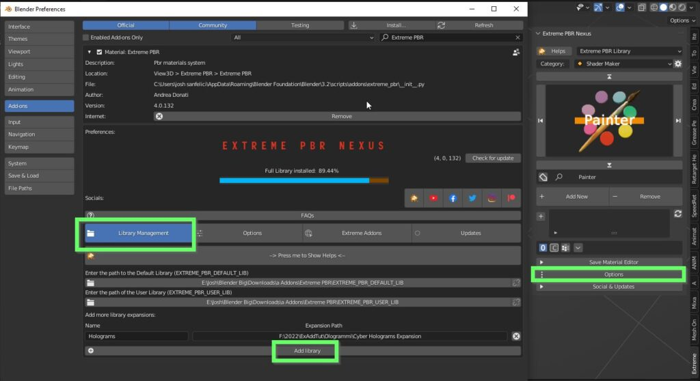
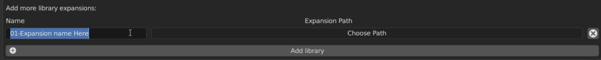
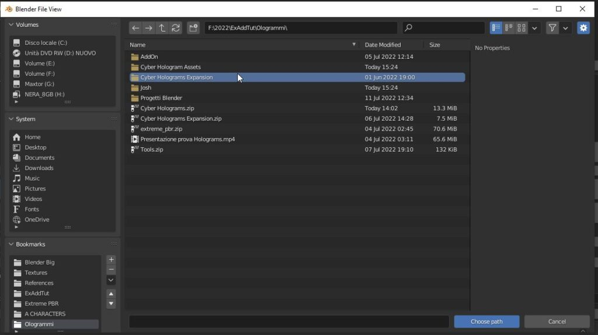
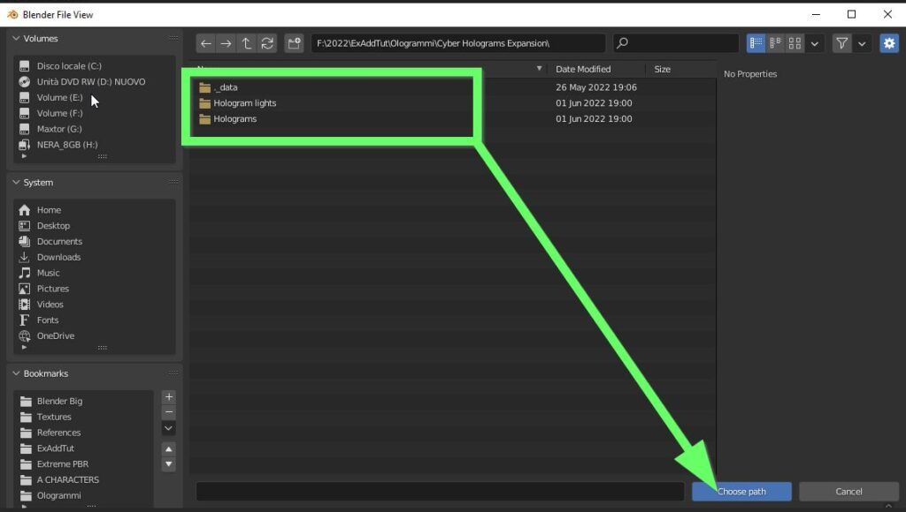
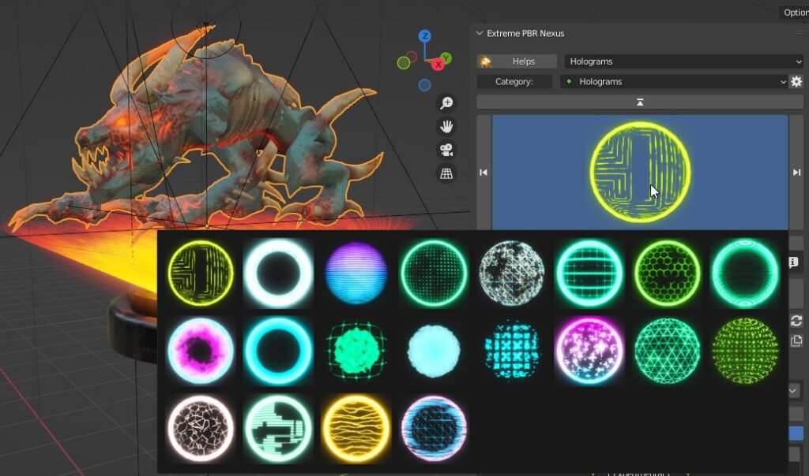
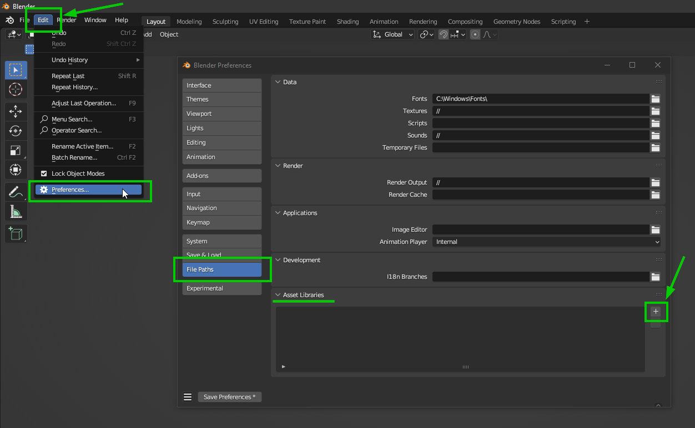
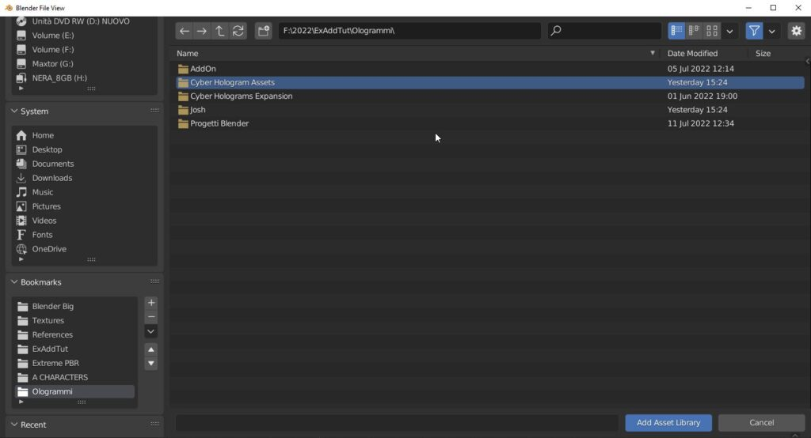
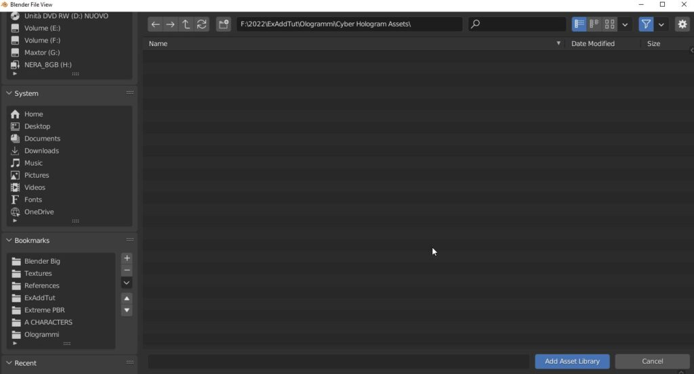

Installation
=================

Welcome to the installation guide for Holograms Expansion

.. Note:: Cyber Holograms is distributed in 2 versions, you will find the following in your downloads:

          - Cyber Hologram Assets (Version for Blender asset browser)
          - Cyber Hologram Expansion (Version for Extreme PBR)

          Pay attention to which version you want to install, if you have any doubts please proceed with this guide.
          **The versions are contained in the zip file "Cyber Holograms.zip"**

Install into Extreme PBR
----------------------------

If you own Extreme PBR here is a video tutorial on how to install the expansion pack
"Cyber Holograms Expansion" inside Extreme PBR

.. raw:: html

        <iframe width="560" height="315" src="https://www.youtube.com/embed/yc5Xw7eW_rw" title="YouTube video player"
        frameborder="0" allow="accelerometer; autoplay; clipboard-write; encrypted-media; gyroscope; picture-in-picture;
        web-share" allowfullscreen style="display: block; margin: auto;"></iframe>

------------------------------------------------------------------------------------------------------------------------

**Add Expansion into Extreme PBR**

Take 2 minutes and make sure you have downloaded the necessary files for the installation, once you have downloaded
the files make sure you have the folder **"Cyber Holograms Expansion"** which is the one to add to the extensions of Extreme PBR

So let's proceed, to add the expansion to Extreme PBR, open Extreme PBR and press on **Options > Library Management > Add Library**

------------------------------------------------------------------------------------------------------------------------

**Set a name for the new Library, i.e. Holograms**

------------------------------------------------------------------------------------------------------------------------

**Press Choose path and select the folder**

------------------------------------------------------------------------------------------------------------------------

**Double click on the folder to open it, then press the “Choose path” button**

------------------------------------------------------------------------------------------------------------------------

**You will find the new Library in the Libraries dropdown menu**

.. image:: _static/_images/installation/add_into_extreme_pbr_expansion_05.jpg
    :align: center
    :width: 300
    :alt: add_into_extreme_pbr_expansion_05

------------------------------------------------------------------------------------------------------------------------

**Once selected you’ll have access to all different Hologram and Light Rays materials**

------------------------------------------------------------------------------------------------------------------------

Install into Asset Browser
----------------------------

Here is a video tutorial on how to install the version for the asset browser in Blender

.. raw:: html

        <iframe width="560" height="315" src="https://www.youtube.com/embed/Li6ckkrM0-g" title="YouTube video player"
        frameborder="0" allow="accelerometer; autoplay; clipboard-write; encrypted-media; gyroscope; picture-in-picture;
        web-share" allowfullscreen style="display: block; margin: auto;"></iframe>

------------------------------------------------------------------------------------------------------------------------

**Add a new Asset Library**

In Blender, go to **edit-->preferences-->File paths** and click on the plus button to add an Asset Library

------------------------------------------------------------------------------------------------------------------------

**Locate the Cyber Hologram Assets folder**

Once you press the plus button, a browser window will open, here you will have to locate the **Cyber Hologram Assets** folder

------------------------------------------------------------------------------------------------------------------------

**Double click to open it and then press the Add Asset Library button**

